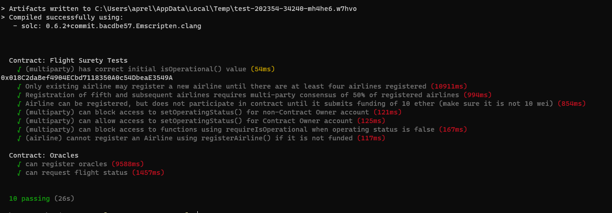
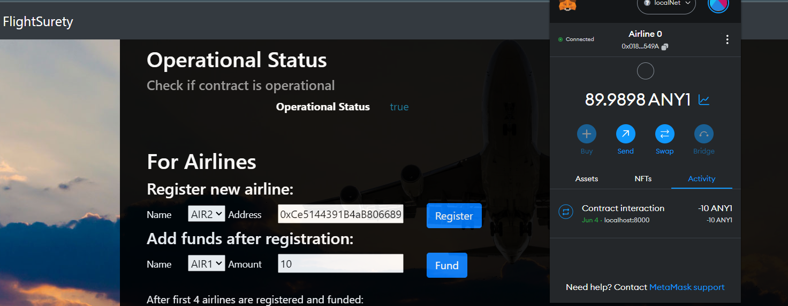
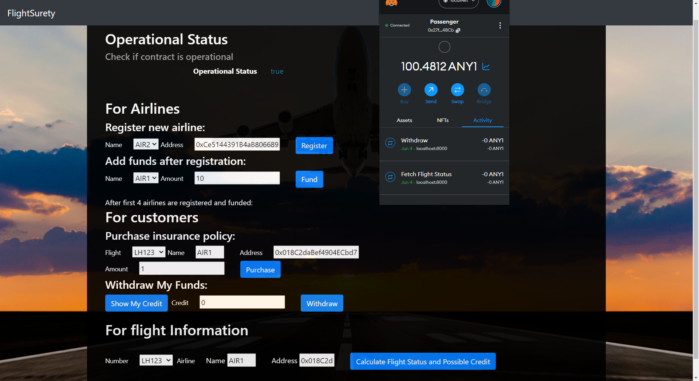

# FlightSurety

FlightSurety is a sample application project for Udacity's Blockchain course.

## Versions of used software
output of `truffle version`
* Truffle v5.1.14-nodeLTS.0 (core: 5.1.13)
* Solidity - 0.6.2 (solc-js)
* Node v16.13.1
* Web3.js v1.2.1

## Tests

To run truffle tests:

`truffle test`

## Metamask

1) Metamask needs to be connected to the local ganache blockchain ()
2) You will need to import into Metamask at least the addresses of the 

   * first airline (0x018C2daBef4904ECbd7118350A0c54DbeaE3549A) 
   * customer 1 (0x27f184bdc0E7A931b507ddD689D76Dba10514BCb)

    to test the Dapp in the browser (http://localhost:8000)

3) After every new deployment, you will need to clear the activity data for these addresses in Metamask (Setting -> Advanced -> Clear activity tab data)

## 0. Install, Compile

This repository contains Smart Contract code in Solidity (using Truffle), tests (also using Truffle), dApp scaffolding (using HTML, CSS and JS) and server app scaffolding.

To install, download or clone the repo, then:

`npm install`
`truffle compile`

## 1. Blockchain
We use ganache-cli to create a local blockchain with 30 addresses.

`ganache-cli -m "spirit supply whale amount human item harsh scare congress discover talent hamster" -a 30`

## 2. Migrate smart contracts

`truffle migrate --reset`

## 3. Start Server

`npm run server`

## 4. Start Dapp / Frontend

`npm run dapp`

## 5. View the Dapp:
Open in browser

`http://localhost:8000`

## Voting and Registration
The voting for the 5th and up airline has been tested in the tests, so this functionality is not implemented in the DAPP.

## Oracles' response
In the server.js oracle is configured to return always the status 20 (airline is the reason for flight being late) for test purposes.

## How to use the DAPP

From the addresses generated by the ganache-cli we will use them as follows.
the 0th address is the contract owner (0x27D8D15CbC94527cAdf5eC14B69519aE23288B95)
the 1st address is the first airline, which is already registered during the deployment process
the 2nd address is the second airline, which can be registered by the 1st without voting
the 3rd address is the second airline, which can be registered by the 1st without voting
the 4rd address is the second airline, which can be registered by the 1st without voting
the 5th address is a customer 1
the addresses 10th to 29th are for the oracles.

1) First airline is already registered (Address 0x018C2daBef4904ECbd7118350A0c54DbeaE3549A   Name AIR1)

2) So the first step is to fund the first airline. You can click on the fund button in the DAPP for the AIR1 airline.

3) Now we can use the form to buy an insurance policy.

4) For this we can load the 5th account (0x27f184bdc0E7A931b507ddD689D76Dba10514BCb) into the metamask,

5) Select a flight and amount and click on Purchase. As we have funded only the 1st airline, we can buy an insurance policy only for this.

6) Next we can simulate the Oracle Request by clicking on the Calculate Flight Status button.  It will trigger a process of crediting the insurees, if the final status returned by oracles is 20.

7) The user can then click on the Show my Credit button and the balance of users account will be displayed.

8) User can then withdraw his/her credit amount by clicking on the button "Withdraw"

## Screenshots

Screenshots are available in the folder `screenshots`

Tests are running successfully:

Airline could be funded:

User purchased an insurance policy for 1 ETH and oracle response was 20, therefore user was credited by 1,5 ETH. 
And after that user clicked on the Withdraw button and the operation was successful.

